# Technical Analysis of LUT Files

## Overview

This document provides a comprehensive analysis of 11 LUT files.

## Table of Contents

1. [Summary](#summary)
2. [LUT Specifications](#lut-specifications)
3. [Color Space Transformations](#color-space-transformations)
4. [PATI_night](#lut-1)
5. [3231 Retro](#lut-2)
6. [5210 Vibrant](#lut-3)
7. [3150 Film process - Bleach bypass](#lut-4)
8. [3411 Film - Teal and orange](#lut-5)
9. [V2_Sl3Sg3_B&W_HC1](#lut-6)
10. [5122 City](#lut-7)
11. [MM_dzien](#lut-8)
12. [V2_Sl3Sg3_B&W_ZERO](#lut-9)
13. [Anywhere_LUT_v0.1](#lut-10)
14. [pati_day_wnetrze](#lut-11)

## Summary

| LUT | Source Space | Target Space | Accuracy Score | Dynamic Range |
|-----|--------------|--------------|----------------|---------------|
| PATI_night | Unknown | Unknown | 0.00% | 50.47 |
| 3231 Retro | Unknown | Rec.709 (Stylized) | 0.00% | 1985.68 |
| 5210 Vibrant | Unknown | Unknown | 0.00% | 963312.33 |
| 3150 Film process - Bleach bypass | Unknown | Rec.709 (Stylized) | 0.00% | 20.34 |
| 3411 Film - Teal and orange | Unknown | Rec.709 (Stylized) | 0.00% | 1000000.00 |
| V2_Sl3Sg3_B&W_HC1 | S-Log3/S-Gamut3 | Rec.709 (B&W) | 0.00% | 998794.33 |
| 5122 City | Unknown | Unknown | 0.00% | 43.79 |
| MM_dzien | Unknown | Unknown | 0.00% | 1000000.00 |
| V2_Sl3Sg3_B&W_ZERO | S-Log3/S-Gamut3 | Rec.709 (B&W) | 0.00% | 1000000.00 |
| Anywhere_LUT_v0.1 | Unknown | Unknown | 0.00% | 993652.33 |
| pati_day_wnetrze | Unknown | Unknown | 0.00% | 979649.67 |

## LUT Specifications

| LUT | Size | Min RGB | Max RGB | Dominant Channel |
|-----|------|---------|---------|------------------|
| PATI_night | 33x33x33 | [0.010, 0.026, 0.007] | [1.000, 0.997, 0.991] | G |
| 3231 Retro | 33x33x33 | [0.000, 0.000, 0.001] | [1.000, 1.000, 0.915] | R |
| 5210 Vibrant | 33x33x33 | [0.000, 0.000, 0.000] | [0.988, 0.967, 1.000] | G |
| 3150 Film process - Bleach bypass | 33x33x33 | [0.044, 0.052, 0.051] | [1.000, 1.000, 1.000] | B |
| 3411 Film - Teal and orange | 33x33x33 | [0.000, 0.000, 0.000] | [1.000, 1.000, 1.000] | G |
| V2_Sl3Sg3_B&W_HC1 | 33x33x33 | [0.000, 0.000, 0.000] | [0.999, 0.999, 0.999] | G |
| 5122 City | 33x33x33 | [0.000, 0.003, 0.000] | [1.000, 0.929, 1.000] | R |
| MM_dzien | 33x33x33 | [0.000, 0.000, 0.000] | [1.000, 1.000, 1.000] | G |
| V2_Sl3Sg3_B&W_ZERO | 33x33x33 | [0.000, 0.000, 0.000] | [1.000, 1.000, 1.000] | G |
| Anywhere_LUT_v0.1 | 33x33x33 | [0.000, 0.000, 0.000] | [0.996, 0.990, 0.996] | G |
| pati_day_wnetrze | 33x33x33 | [0.000, 0.000, 0.000] | [1.000, 0.988, 0.951] | G |

## Color Space Transformations

| LUT | Source → Target | Mean Error | Max Error | RMSE | Correlation |
|-----|-----------------|------------|-----------|------|-------------|
| PATI_night | Unknown → Unknown | 0.2971 | 0.9989 | 0.4030 | 0.3667 |
| 3231 Retro | Unknown → Rec.709 (Stylized) | 0.2444 | 0.9804 | 0.3509 | 0.5005 |
| 5210 Vibrant | Unknown → Unknown | 0.2543 | 1.0000 | 0.3877 | 0.4063 |
| 3150 Film process - Bleach bypass | Unknown → Rec.709 (Stylized) | 0.2441 | 0.9634 | 0.3534 | 0.4840 |
| 3411 Film - Teal and orange | Unknown → Rec.709 (Stylized) | 0.2702 | 1.0000 | 0.3687 | 0.4046 |
| V2_Sl3Sg3_B&W_HC1 | S-Log3/S-Gamut3 → Rec.709 (B&W) | 4.9507 | 9.0403 | 6.1037 | 0.4500 |
| 5122 City | Unknown → Unknown | 0.2363 | 0.9225 | 0.3129 | 0.5831 |
| MM_dzien | Unknown → Unknown | 0.2567 | 1.0000 | 0.3906 | 0.4070 |
| V2_Sl3Sg3_B&W_ZERO | S-Log3/S-Gamut3 → Rec.709 (B&W) | 4.9516 | 9.0279 | 6.1076 | 0.4557 |
| Anywhere_LUT_v0.1 | Unknown → Unknown | 0.3078 | 0.9953 | 0.4383 | 0.3458 |
| pati_day_wnetrze | Unknown → Unknown | 0.3024 | 1.0000 | 0.4219 | 0.3605 |

## LUT 1: PATI_night

**Filename:** PATI_night.cube  
**Title:** Generated by Resolve  
**Source Color Space:** Unknown  
**Target Color Space:** Unknown  
**LUT Size:** 33x33x33  

### Color Analysis

**RGB Range:**  
- Min: [0.0097, 0.0257, 0.0071]  
- Max: [1.0000, 0.9972, 0.9911]  
- Mean: [0.5634, 0.6689, 0.6056]  
- Std: [0.3646, 0.2820, 0.2799]  

**Dynamic Range:**  
- Shadow Clipping: R=0.0097, G=0.0424, B=0.0071  
- Highlight Clipping: R=1.0000, G=0.9972, B=0.9911  
- Dynamic Range Ratio: 50.47  

**Color Bias:**  
- Red Ratio: 0.9196  
- Green Ratio: 1.0919  
- Blue Ratio: 0.9885  
- Dominant Channel: G  

**Tonal Smoothness:**  
- Red Smoothness: 0.2389  
- Green Smoothness: 0.2430  
- Blue Smoothness: 0.2471  
- Overall Smoothness: 0.2430  
- Banding Regions: R=0.00%, G=0.01%, B=0.00%  

### Transformation Accuracy

**Overall Accuracy Score: 0.00%**  

- Mean Absolute Error: 0.2971  
- Maximum Error: 0.9989  
- RMSE: 0.4030  
- Correlation: 0.3667  

**Channel Errors:**  
- Red: 0.3063  
- Green: 0.2445  
- Blue: 0.3404  

### Visualizations

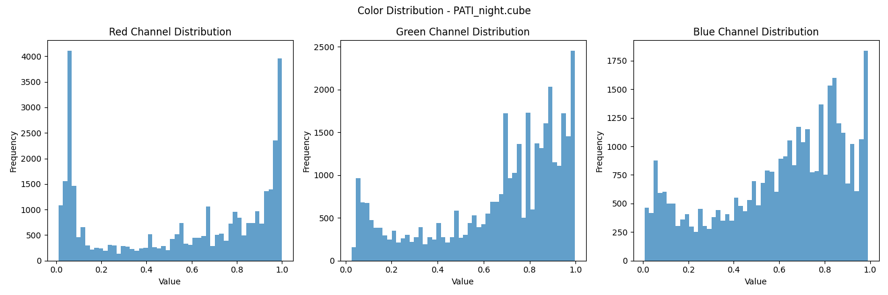  
*RGB Distribution*  

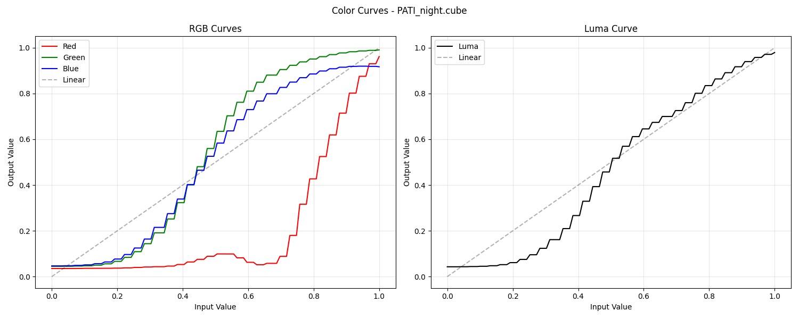  
*Color Curves*  

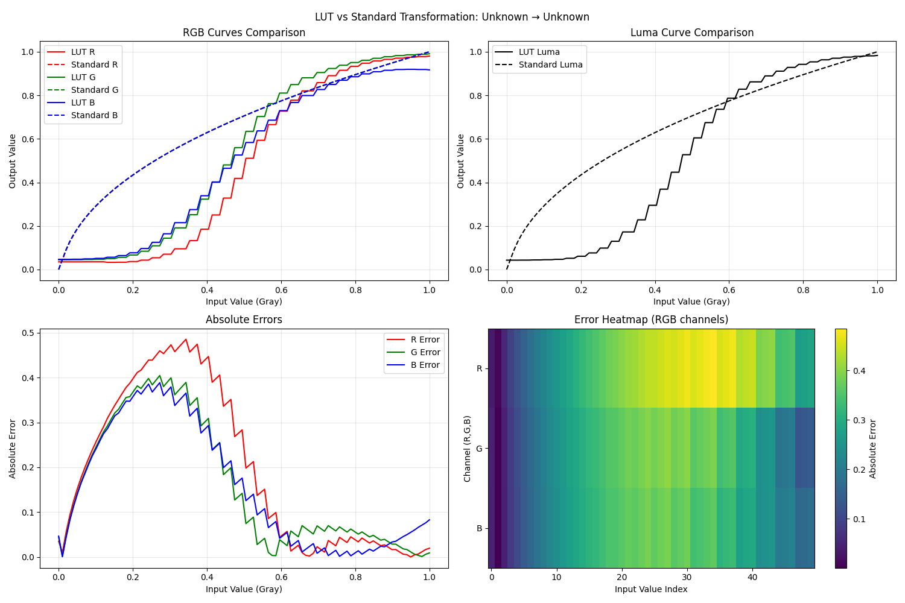  
*Transformation Comparison*  

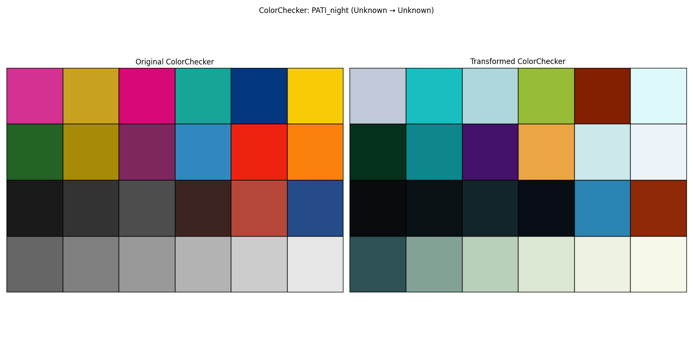  
*ColorChecker Before/After*  

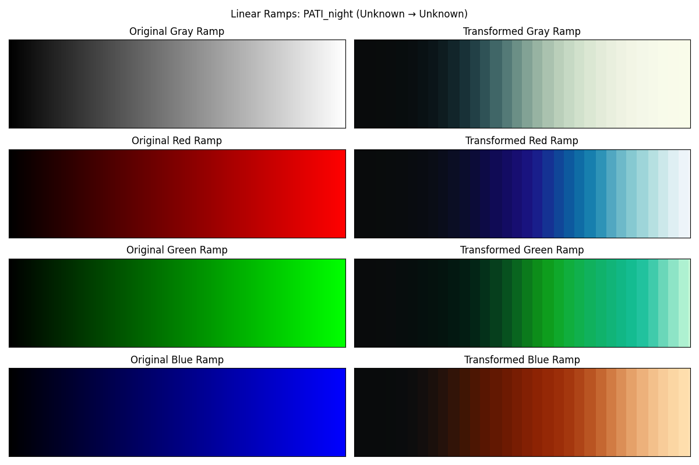  
*Linear Gradient Ramps*  

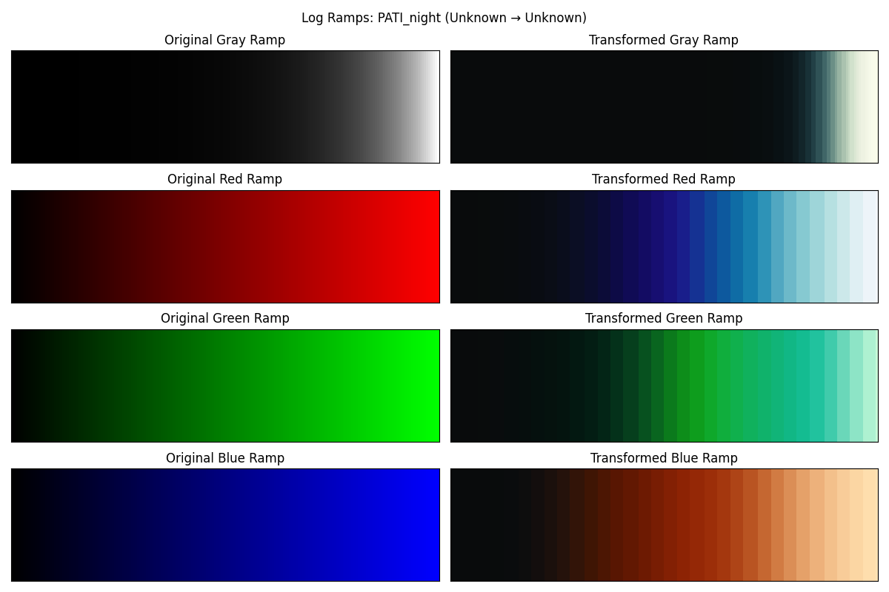  
*Logarithmic Gradient Ramps*  

### Technical Assessment

**Overall Quality Rating: Very Poor (7.29%)**

**Strengths:**  
- Good dynamic range preservation  
- Well-balanced color rendition  

**Weaknesses:**  
- Lower accuracy in color transformation  
- Potential banding issues in smooth gradients  

**Recommended Applications:**  
- Experimental or specific creative effects  

---

## LUT 2: 3231 Retro

**Filename:** 3231 Retro.cube  
**Title:** Not specified  
**Source Color Space:** Unknown  
**Target Color Space:** Rec.709 (Stylized)  
**LUT Size:** 33x33x33  

### Color Analysis

**RGB Range:**  
- Min: [0.0000, 0.0000, 0.0015]  
- Max: [1.0000, 1.0000, 0.9150]  
- Mean: [0.5435, 0.5009, 0.4416]  
- Std: [0.2671, 0.2974, 0.1974]  

**Dynamic Range:**  
- Shadow Clipping: R=0.0000, G=0.0000, B=0.0015  
- Highlight Clipping: R=1.0000, G=1.0000, B=0.9150  
- Dynamic Range Ratio: 1985.68  

**Color Bias:**  
- Red Ratio: 1.0973  
- Green Ratio: 1.0113  
- Blue Ratio: 0.8915  
- Dominant Channel: R  

**Tonal Smoothness:**  
- Red Smoothness: 0.3143  
- Green Smoothness: 0.3104  
- Blue Smoothness: 0.3184  
- Overall Smoothness: 0.3144  
- Banding Regions: R=0.00%, G=0.00%, B=0.00%  

### Transformation Accuracy

**Overall Accuracy Score: 0.00%**  

- Mean Absolute Error: 0.2444  
- Maximum Error: 0.9804  
- RMSE: 0.3509  
- Correlation: 0.5005  

**Channel Errors:**  
- Red: 0.3191  
- Green: 0.1003  
- Blue: 0.3137  

### Visualizations

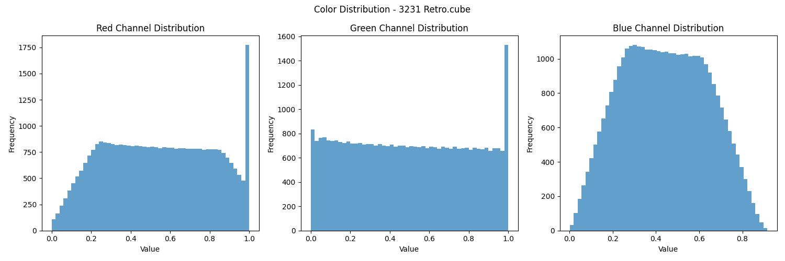  
*RGB Distribution*  

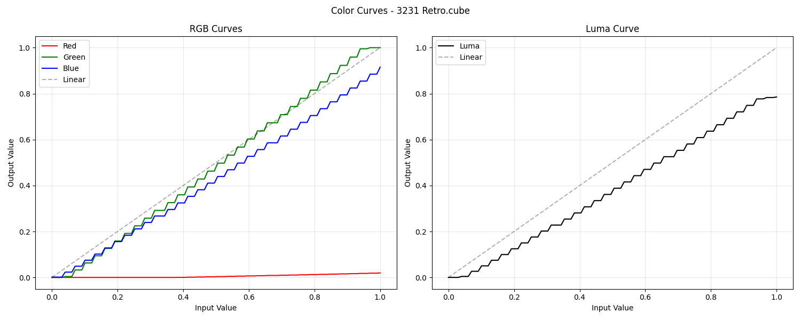  
*Color Curves*  

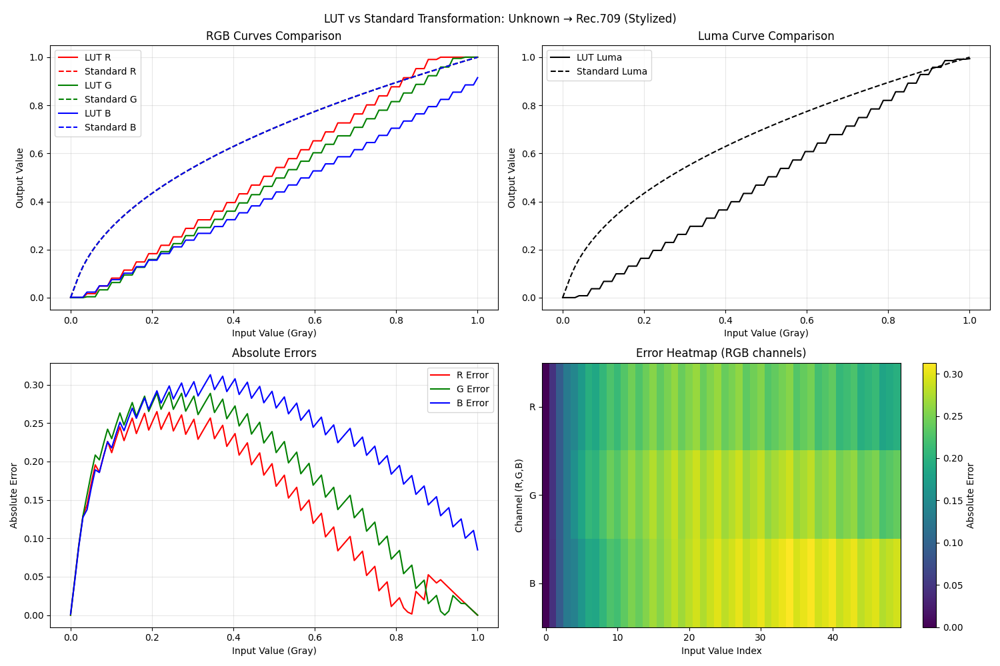  
*Transformation Comparison*  

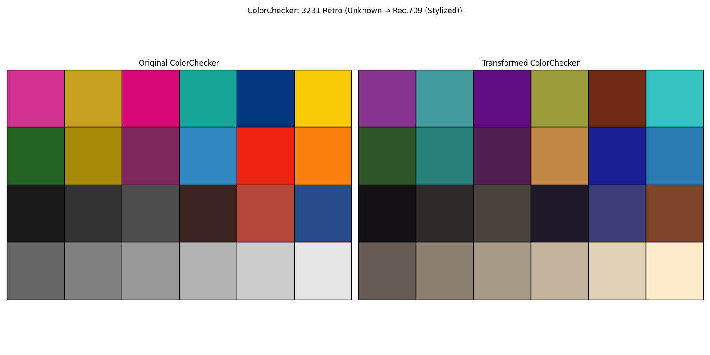  
*ColorChecker Before/After*  

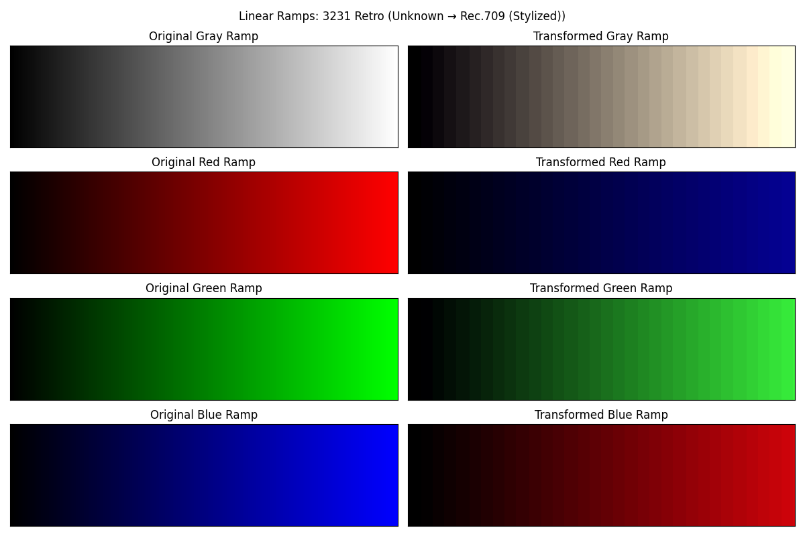  
*Linear Gradient Ramps*  

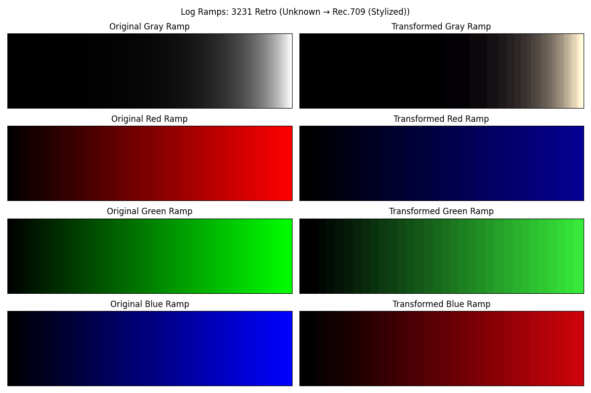  
*Logarithmic Gradient Ramps*  

### Technical Assessment

**Overall Quality Rating: Very Poor (9.43%)**

**Strengths:**  
- Good dynamic range preservation  

**Weaknesses:**  
- Lower accuracy in color transformation  
- Potential banding issues in smooth gradients  

**Recommended Applications:**  
- Creative color grading  

---

## LUT 3: 5210 Vibrant

**Filename:** 5210 Vibrant.cube  
**Title:** Not specified  
**Source Color Space:** Unknown  
**Target Color Space:** Unknown  
**LUT Size:** 33x33x33  

### Color Analysis

**RGB Range:**  
- Min: [0.0000, 0.0000, 0.0000]  
- Max: [0.9877, 0.9669, 1.0000]  
- Mean: [0.4508, 0.4940, 0.4940]  
- Std: [0.3111, 0.2866, 0.3181]  

**Dynamic Range:**  
- Shadow Clipping: R=0.0000, G=0.0000, B=0.0000  
- Highlight Clipping: R=0.9817, G=0.9082, B=1.0000  
- Dynamic Range Ratio: 963312.33  

**Color Bias:**  
- Red Ratio: 0.9399  
- Green Ratio: 1.0301  
- Blue Ratio: 1.0300  
- Dominant Channel: G  

**Tonal Smoothness:**  
- Red Smoothness: 0.3088  
- Green Smoothness: 0.3118  
- Blue Smoothness: 0.3084  
- Overall Smoothness: 0.3097  
- Banding Regions: R=0.00%, G=0.00%, B=0.00%  

### Transformation Accuracy

**Overall Accuracy Score: 0.00%**  

- Mean Absolute Error: 0.2543  
- Maximum Error: 1.0000  
- RMSE: 0.3877  
- Correlation: 0.4063  

**Channel Errors:**  
- Red: 0.3262  
- Green: 0.0895  
- Blue: 0.3474  

### Visualizations

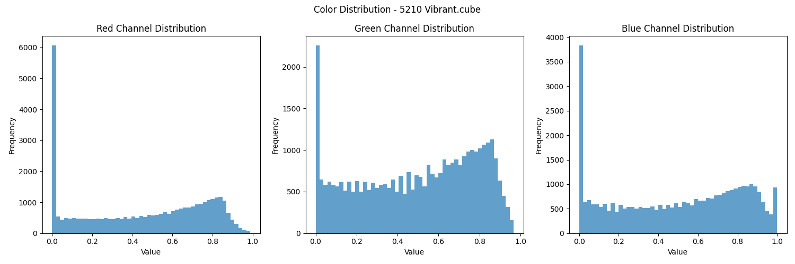  
*RGB Distribution*  

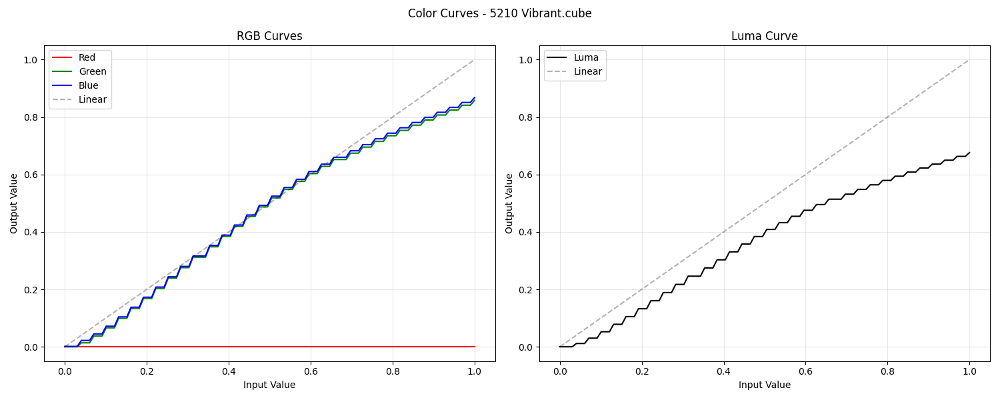  
*Color Curves*  

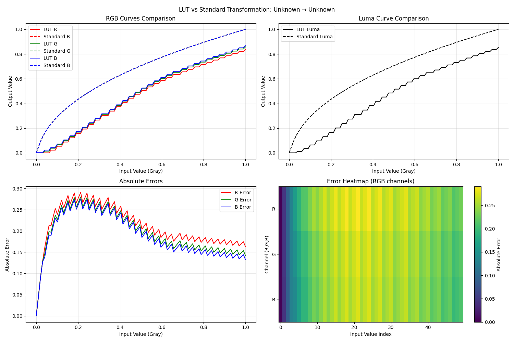  
*Transformation Comparison*  

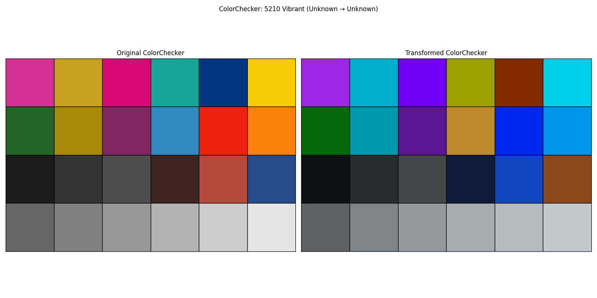  
*ColorChecker Before/After*  

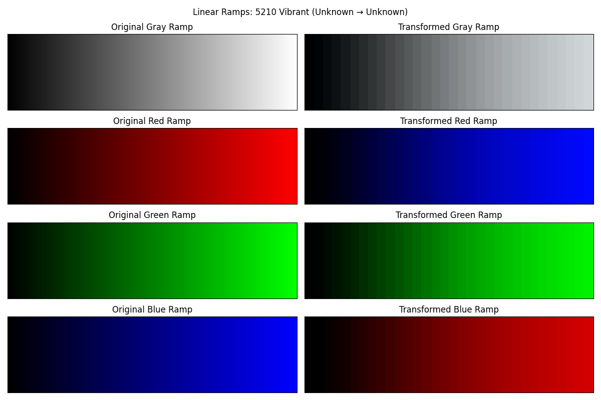  
*Linear Gradient Ramps*  

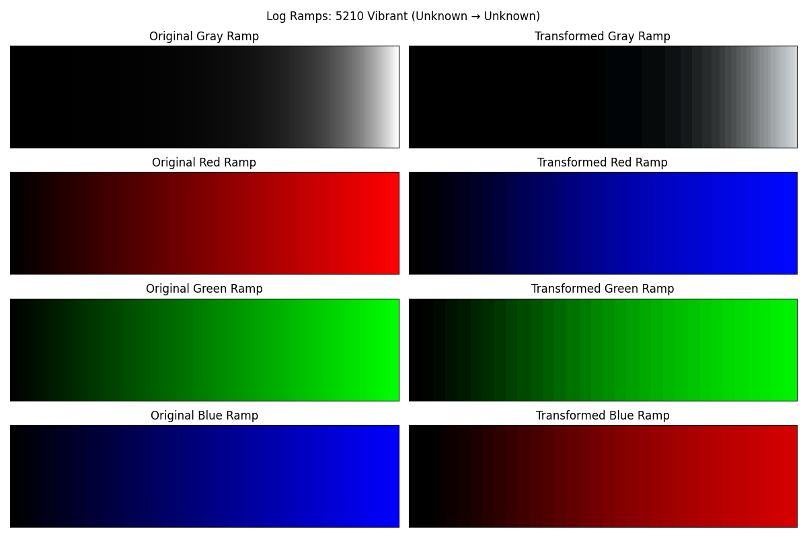  
*Logarithmic Gradient Ramps*  

### Technical Assessment

**Overall Quality Rating: Very Poor (9.29%)**

**Strengths:**  
- Good dynamic range preservation  
- Well-balanced color rendition  

**Weaknesses:**  
- Lower accuracy in color transformation  
- Potential banding issues in smooth gradients  

**Recommended Applications:**  
- Experimental or specific creative effects  

---

## LUT 4: 3150 Film process - Bleach bypass

**Filename:** 3150 Film process - Bleach bypass.cube  
**Title:** Not specified  
**Source Color Space:** Unknown  
**Target Color Space:** Rec.709 (Stylized)  
**LUT Size:** 33x33x33  

### Color Analysis

**RGB Range:**  
- Min: [0.0441, 0.0520, 0.0514]  
- Max: [1.0000, 1.0000, 1.0000]  
- Mean: [0.5525, 0.5408, 0.5625]  
- Std: [0.3084, 0.3196, 0.2798]  

**Dynamic Range:**  
- Shadow Clipping: R=0.0441, G=0.0520, B=0.0514  
- Highlight Clipping: R=1.0000, G=1.0000, B=1.0000  
- Dynamic Range Ratio: 20.34  

**Color Bias:**  
- Red Ratio: 1.0010  
- Green Ratio: 0.9799  
- Blue Ratio: 1.0191  
- Dominant Channel: B  

**Tonal Smoothness:**  
- Red Smoothness: 0.3073  
- Green Smoothness: 0.3025  
- Blue Smoothness: 0.3097  
- Overall Smoothness: 0.3064  
- Banding Regions: R=0.00%, G=0.00%, B=0.00%  

### Transformation Accuracy

**Overall Accuracy Score: 0.00%**  

- Mean Absolute Error: 0.2441  
- Maximum Error: 0.9634  
- RMSE: 0.3534  
- Correlation: 0.4840  

**Channel Errors:**  
- Red: 0.3203  
- Green: 0.1088  
- Blue: 0.3032  

### Visualizations

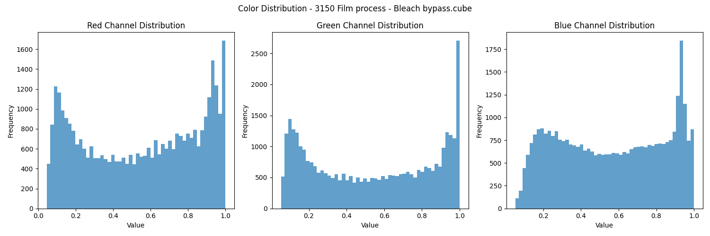  
*RGB Distribution*  

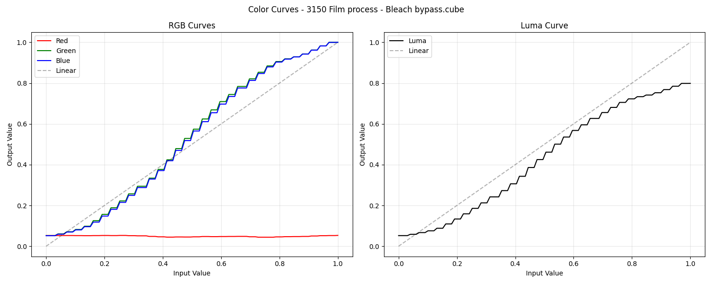  
*Color Curves*  

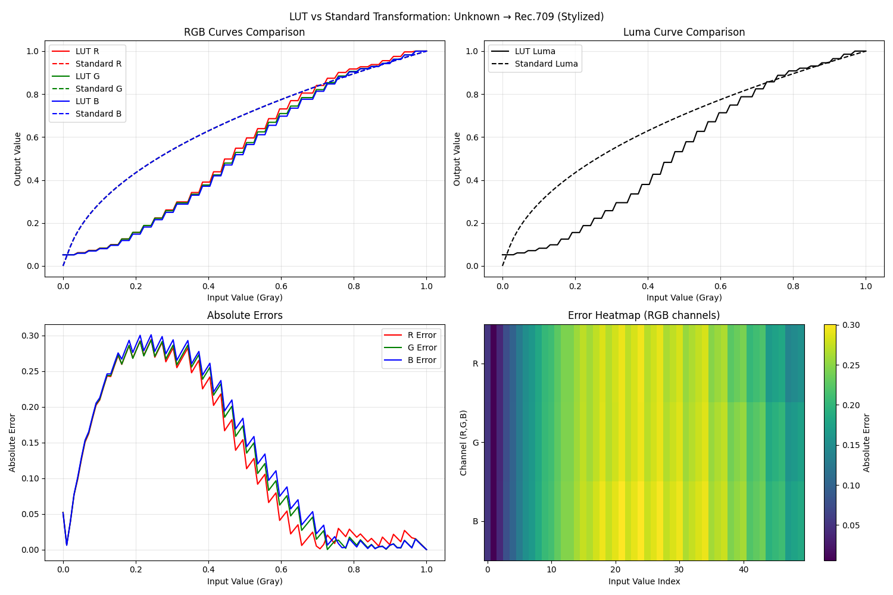  
*Transformation Comparison*  

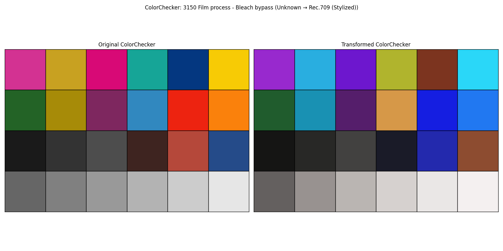  
*ColorChecker Before/After*  

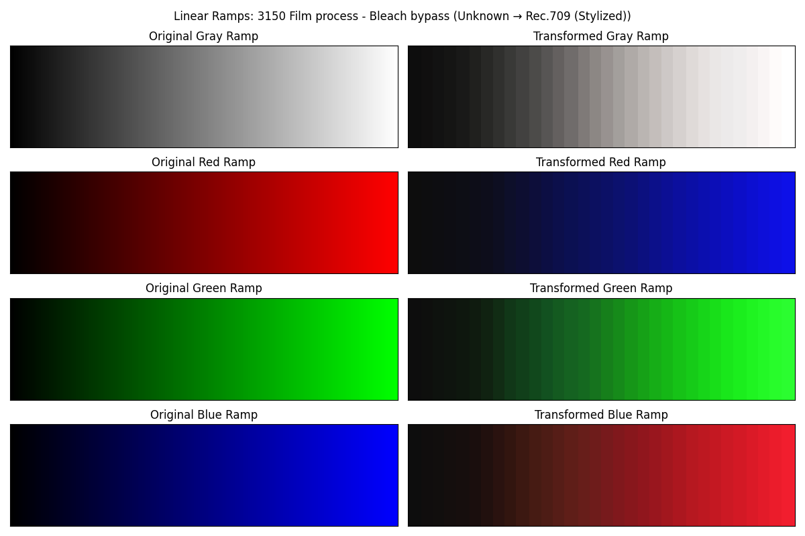  
*Linear Gradient Ramps*  

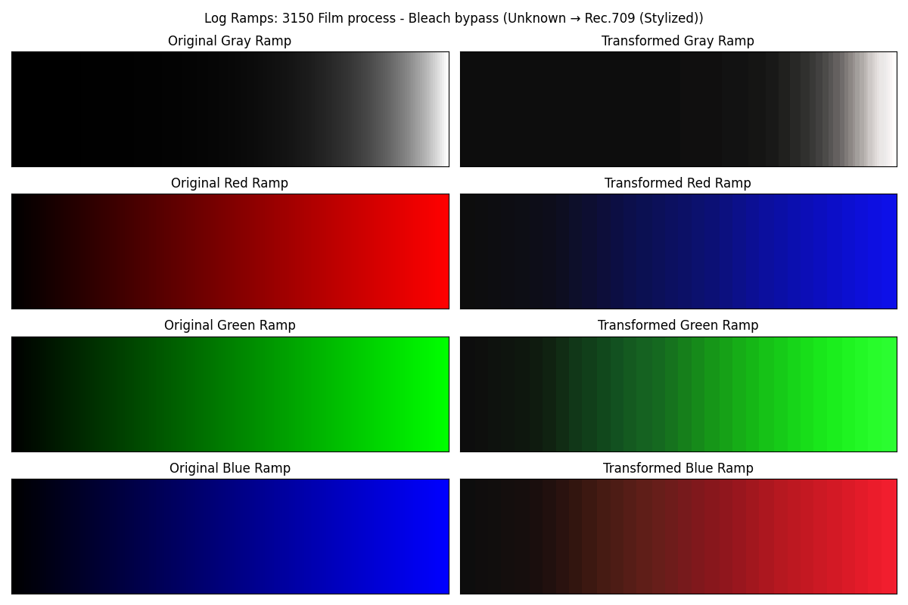  
*Logarithmic Gradient Ramps*  

### Technical Assessment

**Overall Quality Rating: Very Poor (9.19%)**

**Strengths:**  
- Good dynamic range preservation  
- Well-balanced color rendition  

**Weaknesses:**  
- Lower accuracy in color transformation  
- Potential banding issues in smooth gradients  

**Recommended Applications:**  
- Creative color grading  

---

## LUT 5: 3411 Film - Teal and orange

**Filename:** 3411 Film - Teal and orange.cube  
**Title:** Not specified  
**Source Color Space:** Unknown  
**Target Color Space:** Rec.709 (Stylized)  
**LUT Size:** 33x33x33  

### Color Analysis

**RGB Range:**  
- Min: [0.0000, 0.0000, 0.0000]  
- Max: [1.0000, 1.0000, 1.0000]  
- Mean: [0.4755, 0.4785, 0.4275]  
- Std: [0.3540, 0.3220, 0.2520]  

**Dynamic Range:**  
- Shadow Clipping: R=0.0000, G=0.0000, B=0.0000  
- Highlight Clipping: R=1.0000, G=1.0000, B=1.0000  
- Dynamic Range Ratio: 1000000.00  

**Color Bias:**  
- Red Ratio: 1.0327  
- Green Ratio: 1.0391  
- Blue Ratio: 0.9283  
- Dominant Channel: G  

**Tonal Smoothness:**  
- Red Smoothness: 0.2941  
- Green Smoothness: 0.2976  
- Blue Smoothness: 0.3047  
- Overall Smoothness: 0.2987  
- Banding Regions: R=0.00%, G=0.00%, B=0.00%  

### Transformation Accuracy

**Overall Accuracy Score: 0.00%**  

- Mean Absolute Error: 0.2702  
- Maximum Error: 1.0000  
- RMSE: 0.3687  
- Correlation: 0.4046  

**Channel Errors:**  
- Red: 0.3820  
- Green: 0.1601  
- Blue: 0.2685  

### Visualizations

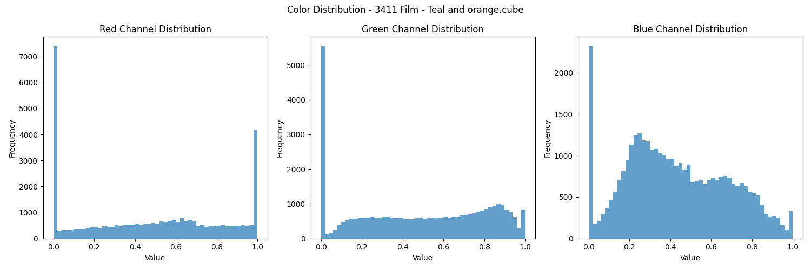  
*RGB Distribution*  

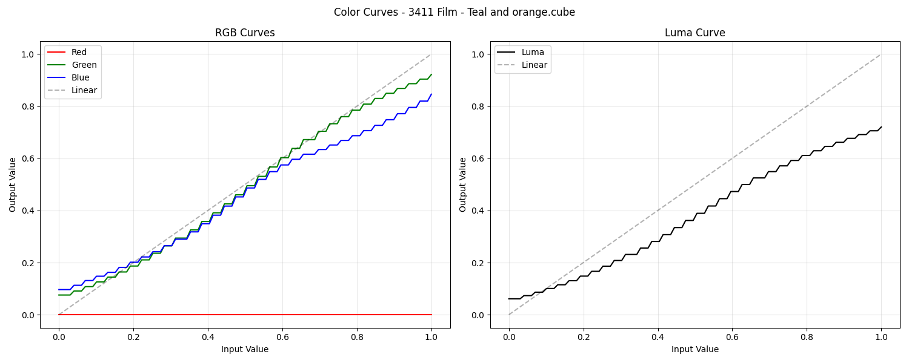  
*Color Curves*  

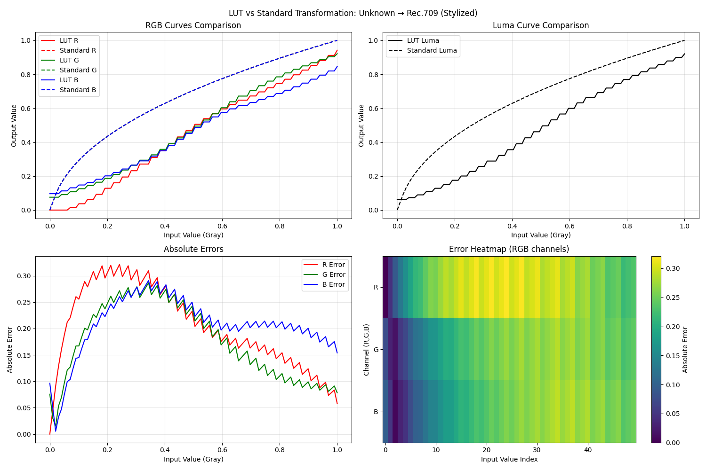  
*Transformation Comparison*  

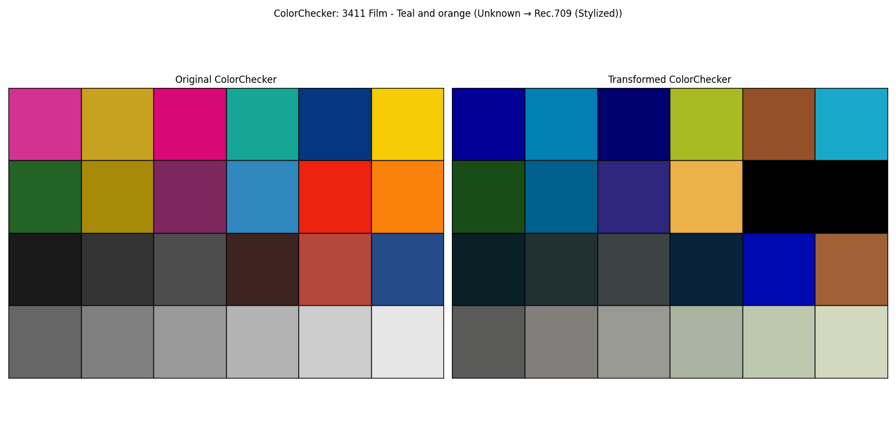  
*ColorChecker Before/After*  

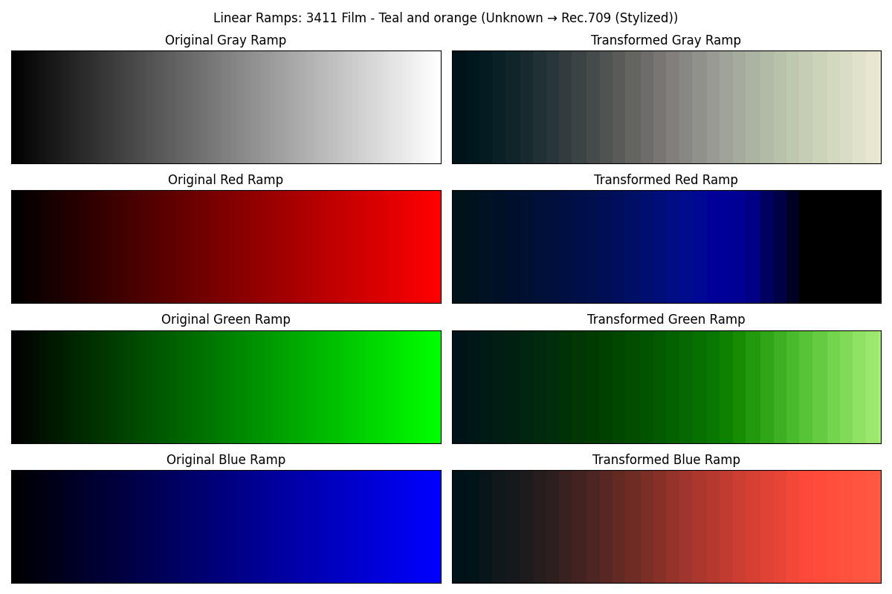  
*Linear Gradient Ramps*  

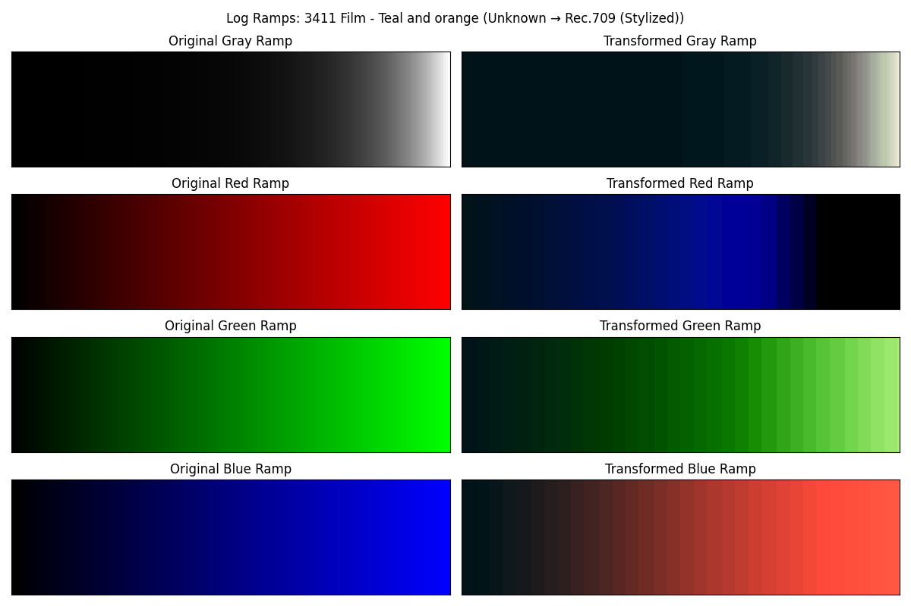  
*Logarithmic Gradient Ramps*  

### Technical Assessment

**Overall Quality Rating: Very Poor (8.96%)**

**Strengths:**  
- Good dynamic range preservation  
- Well-balanced color rendition  

**Weaknesses:**  
- Lower accuracy in color transformation  
- Potential banding issues in smooth gradients  

**Recommended Applications:**  
- Creative color grading  

---

## LUT 6: V2_Sl3Sg3_B&W_HC1

**Filename:** V2_Sl3Sg3_B&W_HC1.cube  
**Title:** Generated by Resolve  
**Source Color Space:** S-Log3/S-Gamut3  
**Target Color Space:** Rec.709 (B&W)  
**LUT Size:** 33x33x33  

### Color Analysis

**RGB Range:**  
- Min: [0.0000, 0.0000, 0.0000]  
- Max: [0.9988, 0.9989, 0.9987]  
- Mean: [0.5659, 0.5661, 0.5563]  
- Std: [0.3401, 0.3403, 0.3405]  

**Dynamic Range:**  
- Shadow Clipping: R=0.0000, G=0.0000, B=0.0000  
- Highlight Clipping: R=0.9988, G=0.9989, B=0.9987  
- Dynamic Range Ratio: 998794.33  

**Color Bias:**  
- Red Ratio: 1.0055  
- Green Ratio: 1.0059  
- Blue Ratio: 0.9885  
- Dominant Channel: G  

**Tonal Smoothness:**  
- Red Smoothness: 0.2233  
- Green Smoothness: 0.2236  
- Blue Smoothness: 0.2241  
- Overall Smoothness: 0.2237  
- Banding Regions: R=0.01%, G=0.01%, B=0.00%  

### Transformation Accuracy

**Overall Accuracy Score: 0.00%**  

- Mean Absolute Error: 4.9507  
- Maximum Error: 9.0403  
- RMSE: 6.1037  
- Correlation: 0.4500  

**Channel Errors:**  
- Red: 5.0122  
- Green: 4.8395  
- Blue: 5.0002  

### Visualizations

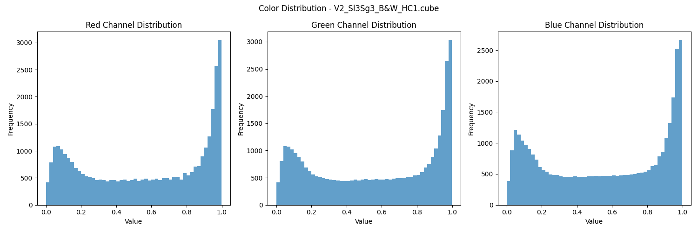  
*RGB Distribution*  

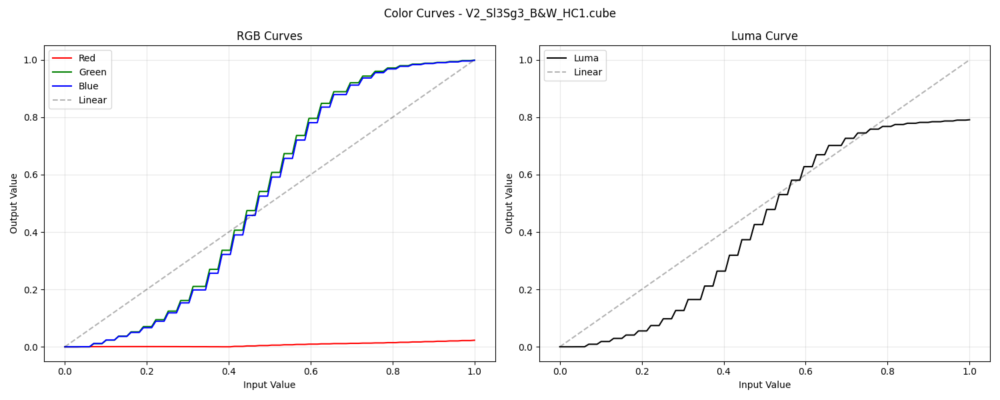  
*Color Curves*  

  
*Transformation Comparison*  

  
*ColorChecker Before/After*  

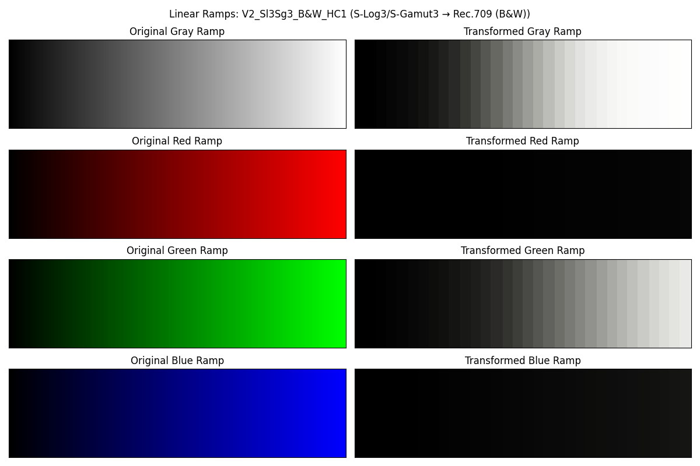  
*Linear Gradient Ramps*  

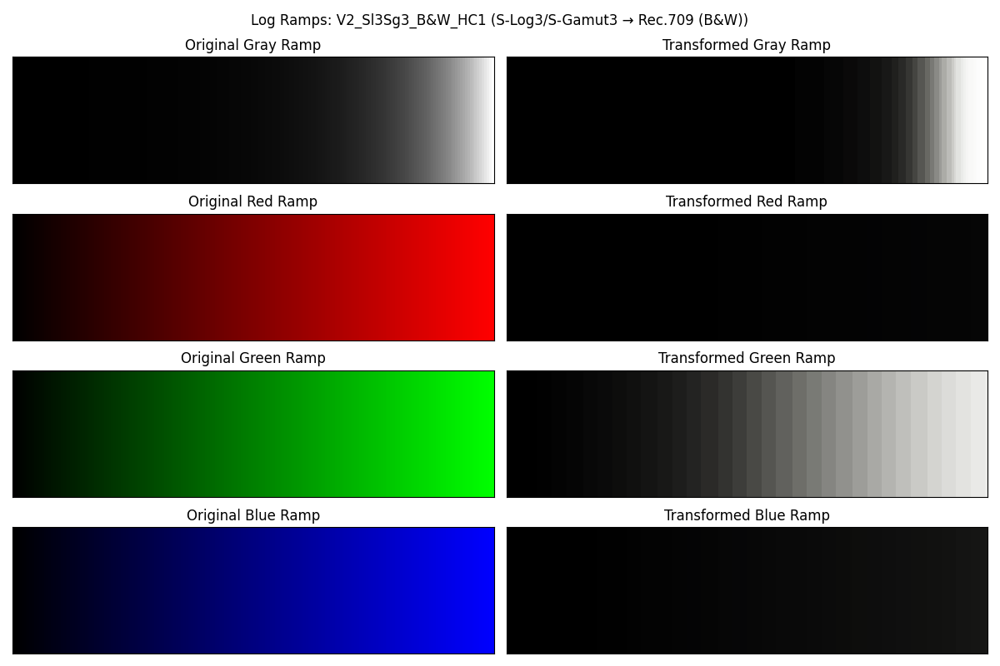  
*Logarithmic Gradient Ramps*  

### Technical Assessment

**Overall Quality Rating: Very Poor (6.71%)**

**Strengths:**  
- Good dynamic range preservation  
- Well-balanced color rendition  

**Weaknesses:**  
- Lower accuracy in color transformation  
- Potential banding issues in smooth gradients  

**Recommended Applications:**  
- Experimental or specific creative effects  

---

## LUT 7: 5122 City

**Filename:** 5122 City.cube  
**Title:** Not specified  
**Source Color Space:** Unknown  
**Target Color Space:** Unknown  
**LUT Size:** 33x33x33  

### Color Analysis

**RGB Range:**  
- Min: [0.0000, 0.0031, 0.0000]  
- Max: [1.0000, 0.9286, 1.0000]  
- Mean: [0.5345, 0.5084, 0.5063]  
- Std: [0.2821, 0.2834, 0.2525]  

**Dynamic Range:**  
- Shadow Clipping: R=0.0110, G=0.0558, B=0.0000  
- Highlight Clipping: R=1.0000, G=0.9237, B=1.0000  
- Dynamic Range Ratio: 43.79  

**Color Bias:**  
- Red Ratio: 1.0351  
- Green Ratio: 0.9845  
- Blue Ratio: 0.9804  
- Dominant Channel: R  

**Tonal Smoothness:**  
- Red Smoothness: 0.2987  
- Green Smoothness: 0.2983  
- Blue Smoothness: 0.2953  
- Overall Smoothness: 0.2974  
- Banding Regions: R=0.00%, G=0.00%, B=0.00%  

### Transformation Accuracy

**Overall Accuracy Score: 0.00%**  

- Mean Absolute Error: 0.2363  
- Maximum Error: 0.9225  
- RMSE: 0.3129  
- Correlation: 0.5831  

**Channel Errors:**  
- Red: 0.2959  
- Green: 0.1327  
- Blue: 0.2804  

### Visualizations

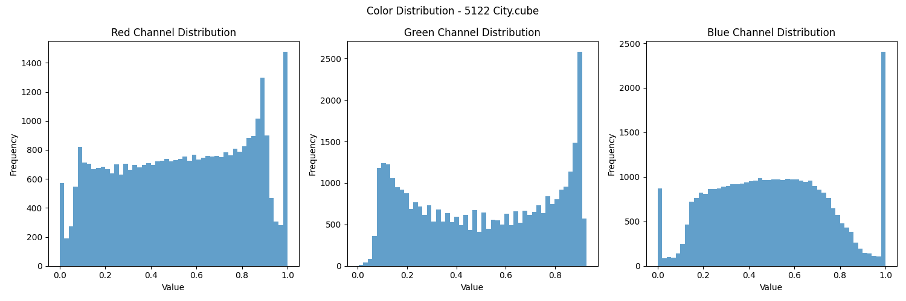  
*RGB Distribution*  

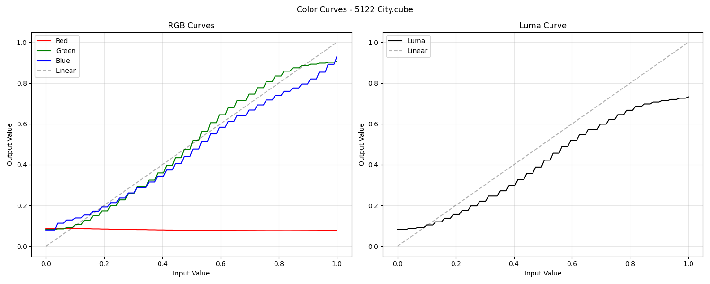  
*Color Curves*  

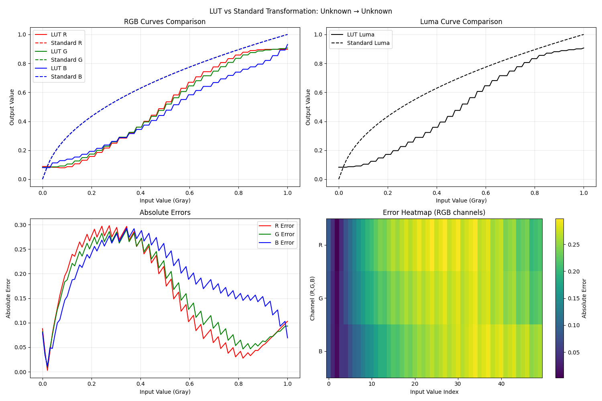  
*Transformation Comparison*  

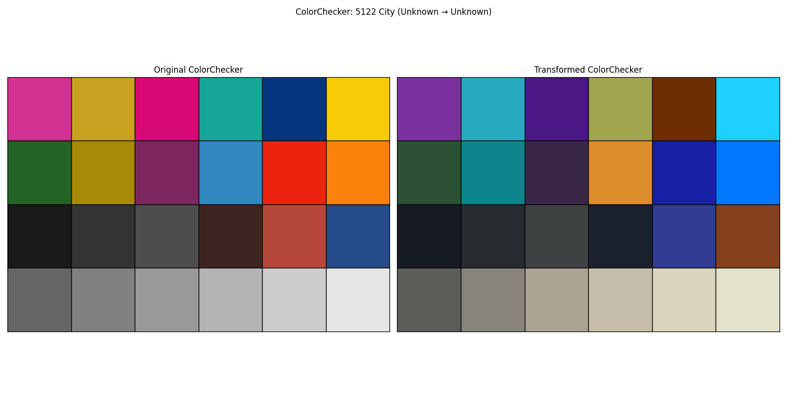  
*ColorChecker Before/After*  

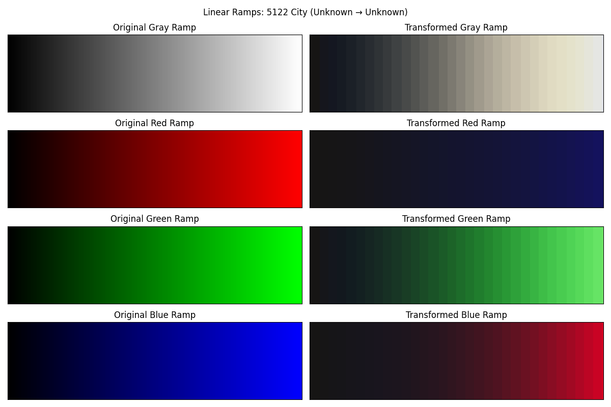  
*Linear Gradient Ramps*  

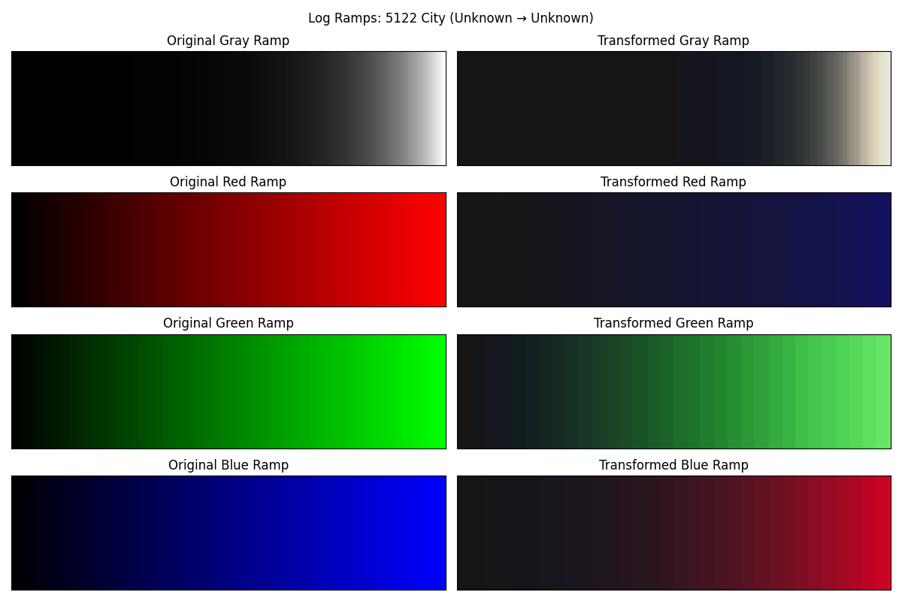  
*Logarithmic Gradient Ramps*  

### Technical Assessment

**Overall Quality Rating: Very Poor (8.92%)**

**Strengths:**  
- Good dynamic range preservation  
- Well-balanced color rendition  

**Weaknesses:**  
- Lower accuracy in color transformation  
- Potential banding issues in smooth gradients  

**Recommended Applications:**  
- Experimental or specific creative effects  

---

## LUT 8: MM_dzien

**Filename:** MM_dzien.cube  
**Title:** Michal Herman  
**Source Color Space:** Unknown  
**Target Color Space:** Unknown  
**LUT Size:** 33x33x33  

### Color Analysis

**RGB Range:**  
- Min: [0.0000, 0.0000, 0.0000]  
- Max: [1.0000, 1.0000, 1.0000]  
- Mean: [0.4571, 0.4844, 0.4745]  
- Std: [0.3259, 0.3310, 0.3277]  

**Dynamic Range:**  
- Shadow Clipping: R=0.0000, G=0.0000, B=0.0000  
- Highlight Clipping: R=1.0000, G=1.0000, B=1.0000  
- Dynamic Range Ratio: 1000000.00  

**Color Bias:**  
- Red Ratio: 0.9685  
- Green Ratio: 1.0262  
- Blue Ratio: 1.0052  
- Dominant Channel: G  

**Tonal Smoothness:**  
- Red Smoothness: 0.3103  
- Green Smoothness: 0.3104  
- Blue Smoothness: 0.3094  
- Overall Smoothness: 0.3100  
- Banding Regions: R=0.00%, G=0.00%, B=0.00%  

### Transformation Accuracy

**Overall Accuracy Score: 0.00%**  

- Mean Absolute Error: 0.2567  
- Maximum Error: 1.0000  
- RMSE: 0.3906  
- Correlation: 0.4070  

**Channel Errors:**  
- Red: 0.3360  
- Green: 0.0971  
- Blue: 0.3369  

### Visualizations

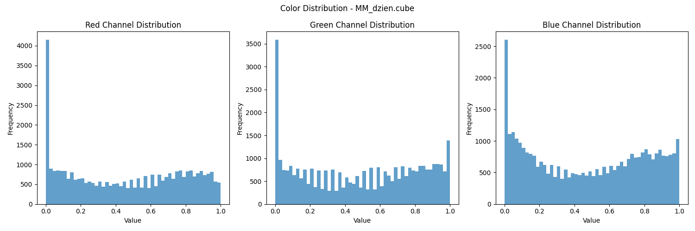  
*RGB Distribution*  

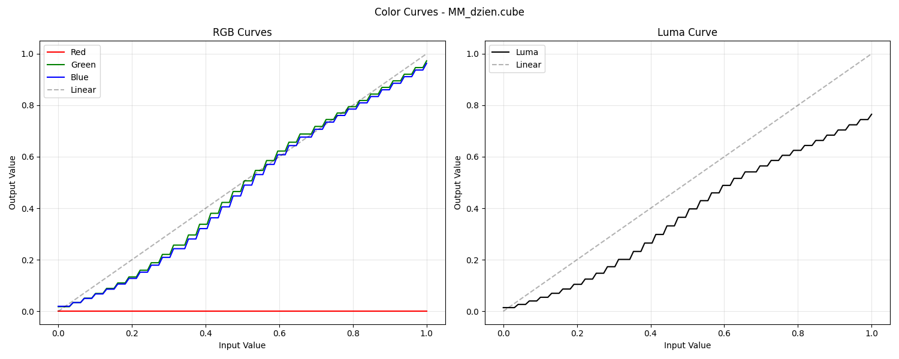  
*Color Curves*  

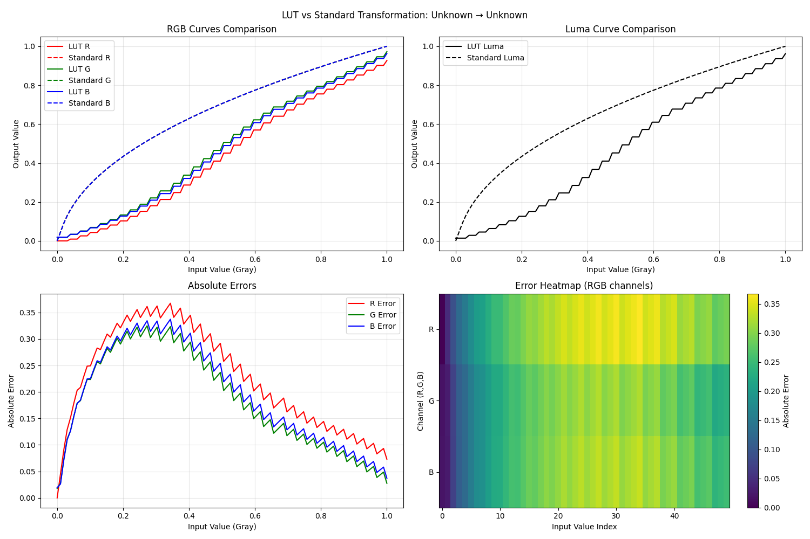  
*Transformation Comparison*  

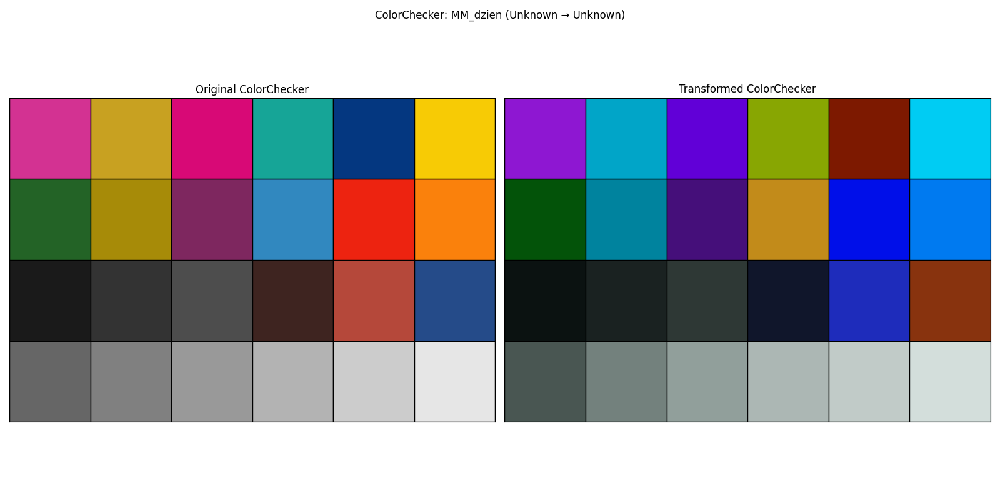  
*ColorChecker Before/After*  

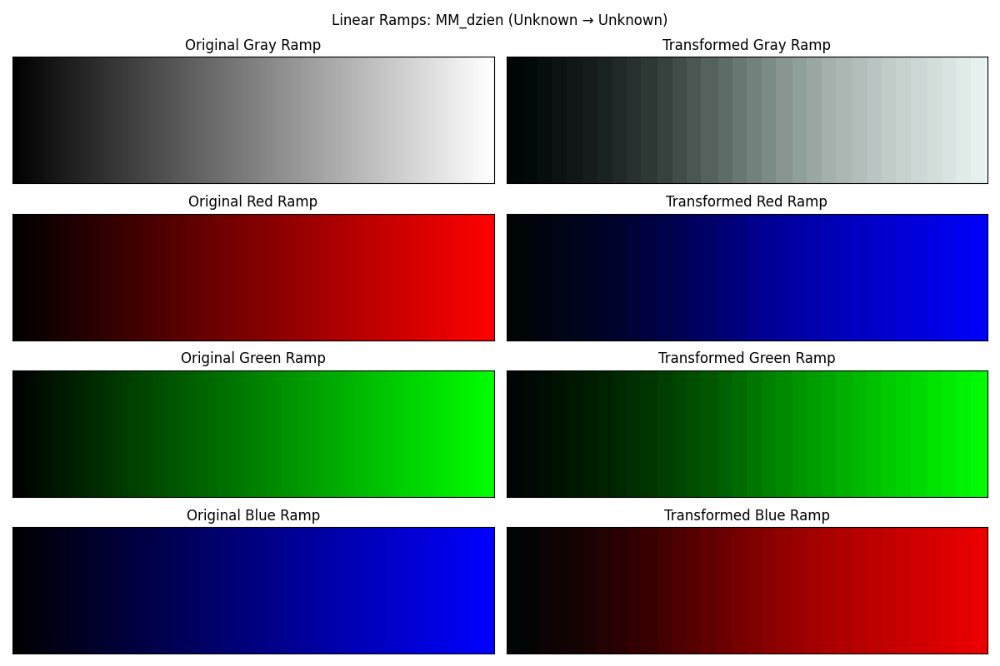  
*Linear Gradient Ramps*  

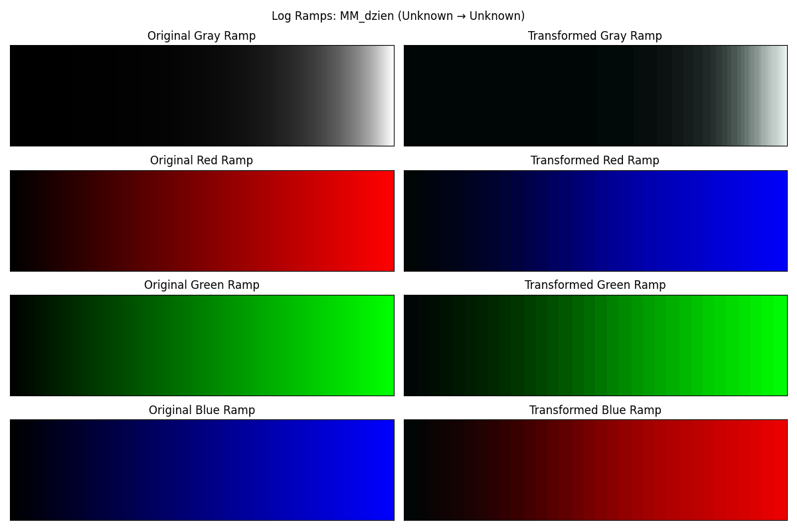  
*Logarithmic Gradient Ramps*  

### Technical Assessment

**Overall Quality Rating: Very Poor (9.30%)**

**Strengths:**  
- Good dynamic range preservation  
- Well-balanced color rendition  

**Weaknesses:**  
- Lower accuracy in color transformation  
- Potential banding issues in smooth gradients  

**Recommended Applications:**  
- Experimental or specific creative effects  

---

## LUT 9: V2_Sl3Sg3_B&W_ZERO

**Filename:** V2_Sl3Sg3_B&W_ZERO.cube  
**Title:** Generated by Resolve  
**Source Color Space:** S-Log3/S-Gamut3  
**Target Color Space:** Rec.709 (B&W)  
**LUT Size:** 33x33x33  

### Color Analysis

**RGB Range:**  
- Min: [0.0000, 0.0000, 0.0000]  
- Max: [1.0000, 1.0000, 1.0000]  
- Mean: [0.5729, 0.5732, 0.5627]  
- Std: [0.3256, 0.3258, 0.3263]  

**Dynamic Range:**  
- Shadow Clipping: R=0.0000, G=0.0000, B=0.0000  
- Highlight Clipping: R=1.0000, G=1.0000, B=1.0000  
- Dynamic Range Ratio: 1000000.00  

**Color Bias:**  
- Red Ratio: 1.0058  
- Green Ratio: 1.0063  
- Blue Ratio: 0.9879  
- Dominant Channel: G  

**Tonal Smoothness:**  
- Red Smoothness: 0.1500  
- Green Smoothness: 0.1502  
- Blue Smoothness: 0.1507  
- Overall Smoothness: 0.1503  
- Banding Regions: R=0.00%, G=0.00%, B=0.00%  

### Transformation Accuracy

**Overall Accuracy Score: 0.00%**  

- Mean Absolute Error: 4.9516  
- Maximum Error: 9.0279  
- RMSE: 6.1076  
- Correlation: 0.4557  

**Channel Errors:**  
- Red: 5.0154  
- Green: 4.8397  
- Blue: 4.9996  

### Visualizations

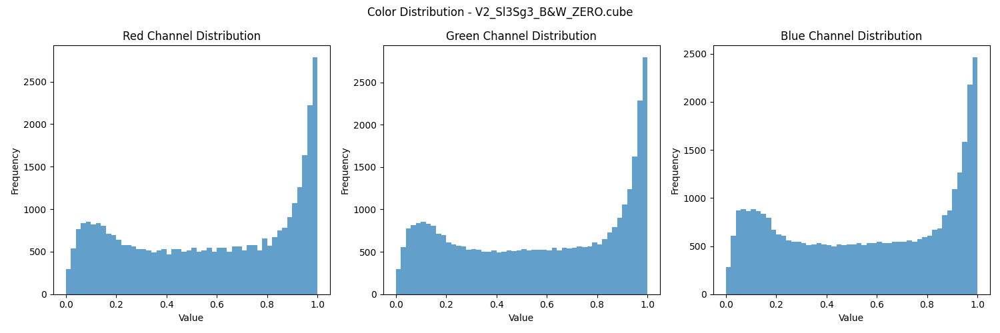  
*RGB Distribution*  

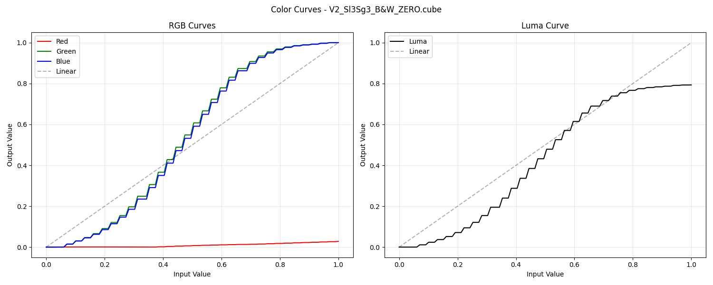  
*Color Curves*  

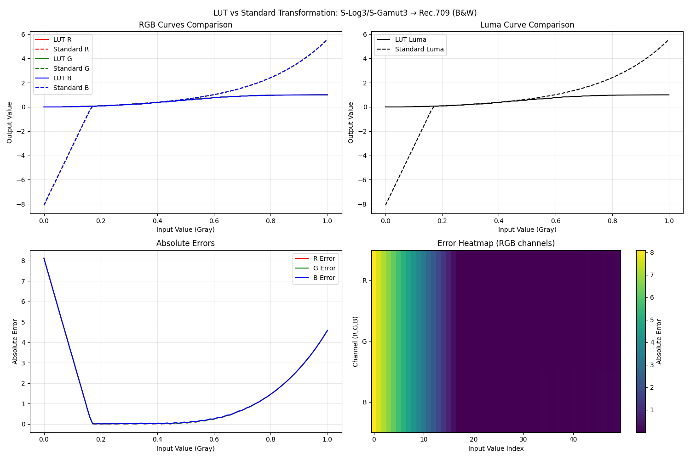  
*Transformation Comparison*  

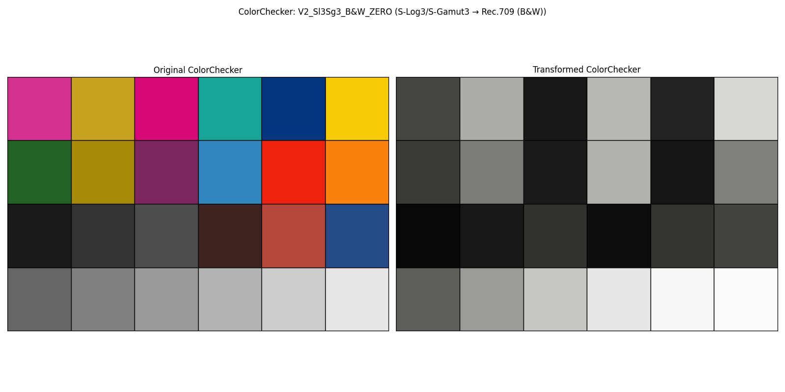  
*ColorChecker Before/After*  

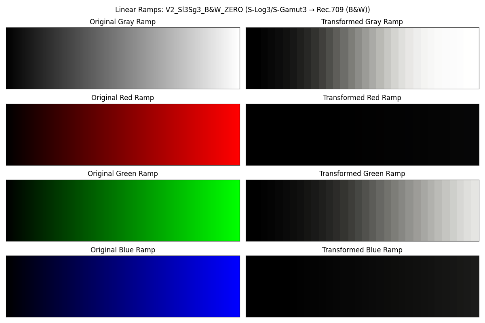  
*Linear Gradient Ramps*  

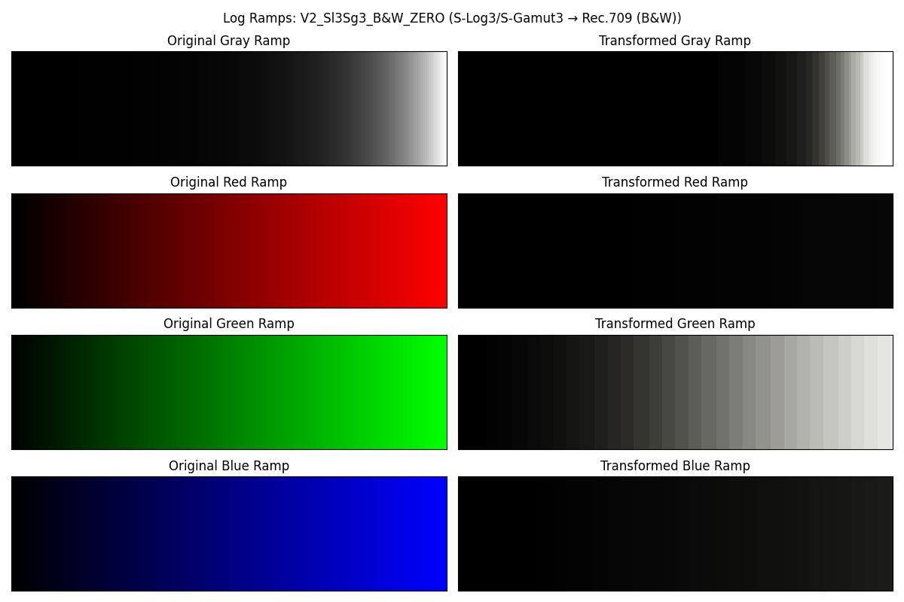  
*Logarithmic Gradient Ramps*  

### Technical Assessment

**Overall Quality Rating: Very Poor (4.51%)**

**Strengths:**  
- Good dynamic range preservation  
- Well-balanced color rendition  

**Weaknesses:**  
- Lower accuracy in color transformation  
- Potential banding issues in smooth gradients  

**Recommended Applications:**  
- Experimental or specific creative effects  

---

## LUT 10: Anywhere_LUT_v0.1

**Filename:** Anywhere_LUT_v0.1.cube  
**Title:** Generated by Resolve  
**Source Color Space:** Unknown  
**Target Color Space:** Unknown  
**LUT Size:** 33x33x33  

### Color Analysis

**RGB Range:**  
- Min: [0.0000, 0.0000, 0.0000]  
- Max: [0.9955, 0.9897, 0.9958]  
- Mean: [0.7050, 0.7291, 0.6898]  
- Std: [0.3344, 0.2833, 0.3013]  

**Dynamic Range:**  
- Shadow Clipping: R=0.0000, G=0.0000, B=0.0000  
- Highlight Clipping: R=0.9955, G=0.9897, B=0.9958  
- Dynamic Range Ratio: 993652.33  

**Color Bias:**  
- Red Ratio: 0.9958  
- Green Ratio: 1.0299  
- Blue Ratio: 0.9743  
- Dominant Channel: G  

**Tonal Smoothness:**  
- Red Smoothness: 0.2377  
- Green Smoothness: 0.2324  
- Blue Smoothness: 0.2625  
- Overall Smoothness: 0.2435  
- Banding Regions: R=0.00%, G=0.03%, B=0.00%  

### Transformation Accuracy

**Overall Accuracy Score: 0.00%**  

- Mean Absolute Error: 0.3078  
- Maximum Error: 0.9953  
- RMSE: 0.4383  
- Correlation: 0.3458  

**Channel Errors:**  
- Red: 0.3173  
- Green: 0.2810  
- Blue: 0.3250  

### Visualizations

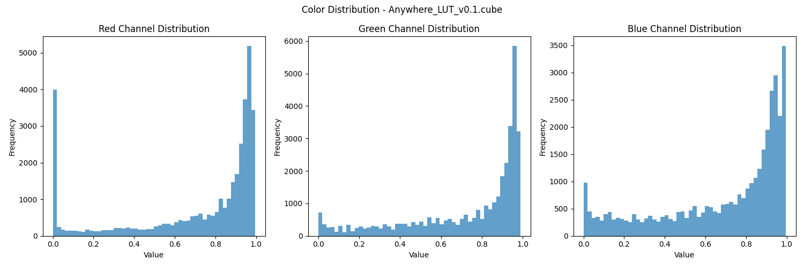  
*RGB Distribution*  

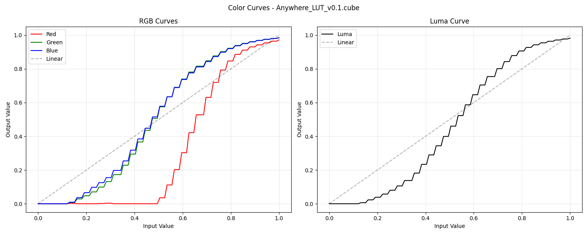  
*Color Curves*  

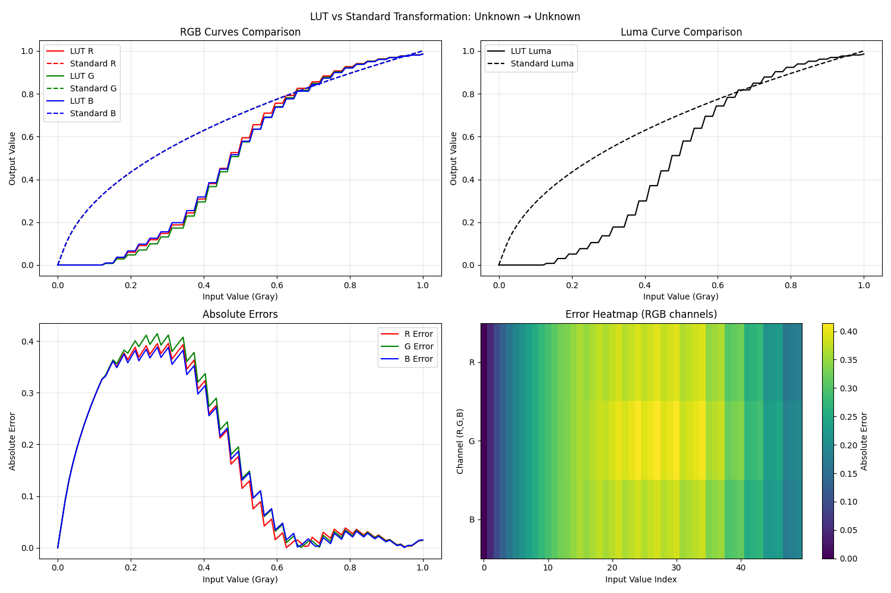  
*Transformation Comparison*  

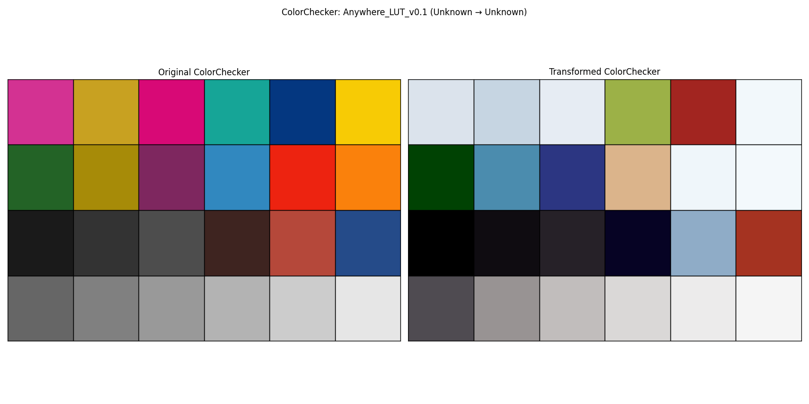  
*ColorChecker Before/After*  

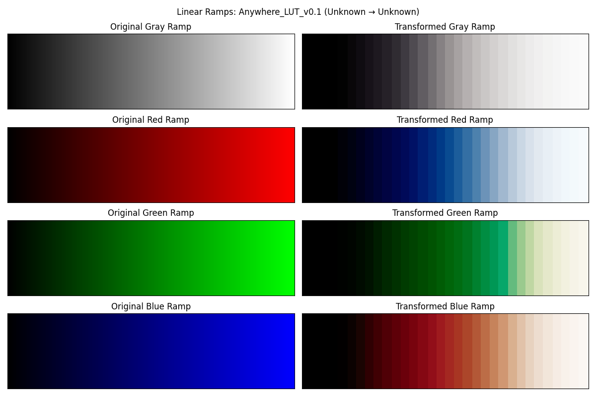  
*Linear Gradient Ramps*  

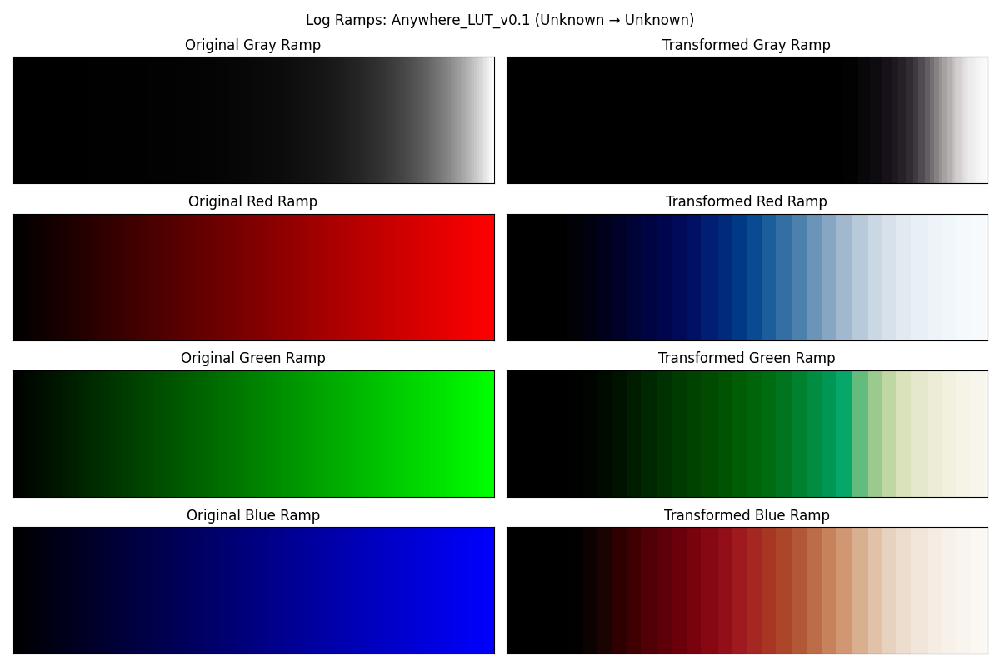  
*Logarithmic Gradient Ramps*  

### Technical Assessment

**Overall Quality Rating: Very Poor (7.30%)**

**Strengths:**  
- Good dynamic range preservation  
- Well-balanced color rendition  

**Weaknesses:**  
- Lower accuracy in color transformation  
- Potential banding issues in smooth gradients  

**Recommended Applications:**  
- Experimental or specific creative effects  

---

## LUT 11: pati_day_wnetrze

**Filename:** pati_day_wnetrze.cube  
**Title:** Generated by Resolve  
**Source Color Space:** Unknown  
**Target Color Space:** Unknown  
**LUT Size:** 33x33x33  

### Color Analysis

**RGB Range:**  
- Min: [0.0000, 0.0000, 0.0000]  
- Max: [1.0000, 0.9879, 0.9512]  
- Mean: [0.6447, 0.7151, 0.6145]  
- Std: [0.3757, 0.2665, 0.2691]  

**Dynamic Range:**  
- Shadow Clipping: R=0.0000, G=0.0000, B=0.0000  
- Highlight Clipping: R=1.0000, G=0.9879, B=0.9511  
- Dynamic Range Ratio: 979649.67  

**Color Bias:**  
- Red Ratio: 0.9796  
- Green Ratio: 1.0866  
- Blue Ratio: 0.9338  
- Dominant Channel: G  

**Tonal Smoothness:**  
- Red Smoothness: 0.2680  
- Green Smoothness: 0.2771  
- Blue Smoothness: 0.2826  
- Overall Smoothness: 0.2758  
- Banding Regions: R=0.00%, G=0.00%, B=0.00%  

### Transformation Accuracy

**Overall Accuracy Score: 0.00%**  

- Mean Absolute Error: 0.3024  
- Maximum Error: 1.0000  
- RMSE: 0.4219  
- Correlation: 0.3605  

**Channel Errors:**  
- Red: 0.3134  
- Green: 0.2516  
- Blue: 0.3423  

### Visualizations

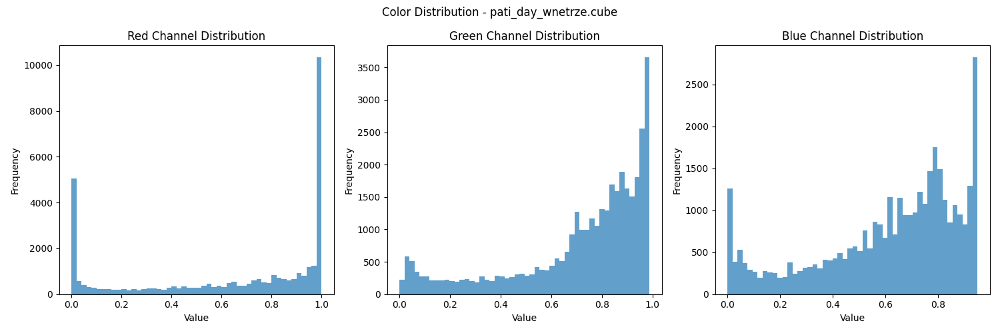  
*RGB Distribution*  

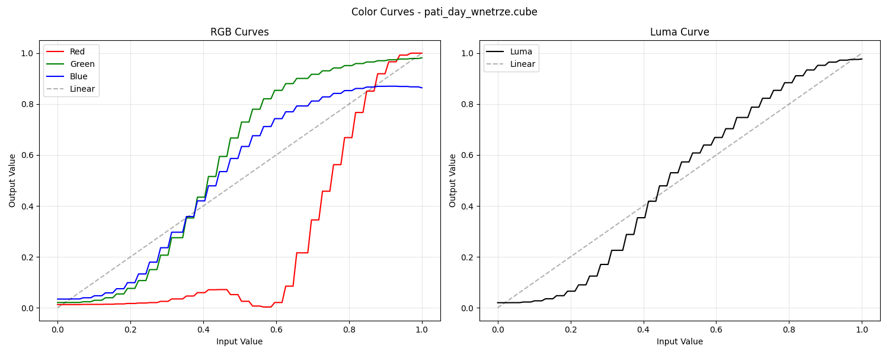  
*Color Curves*  

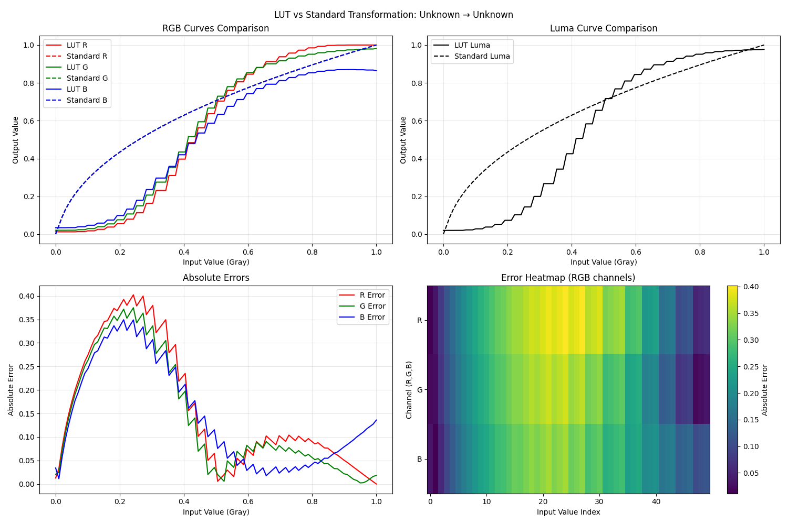  
*Transformation Comparison*  

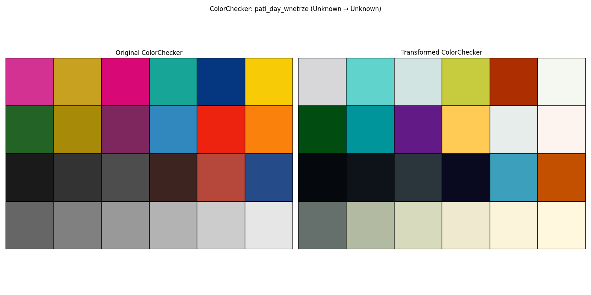  
*ColorChecker Before/After*  

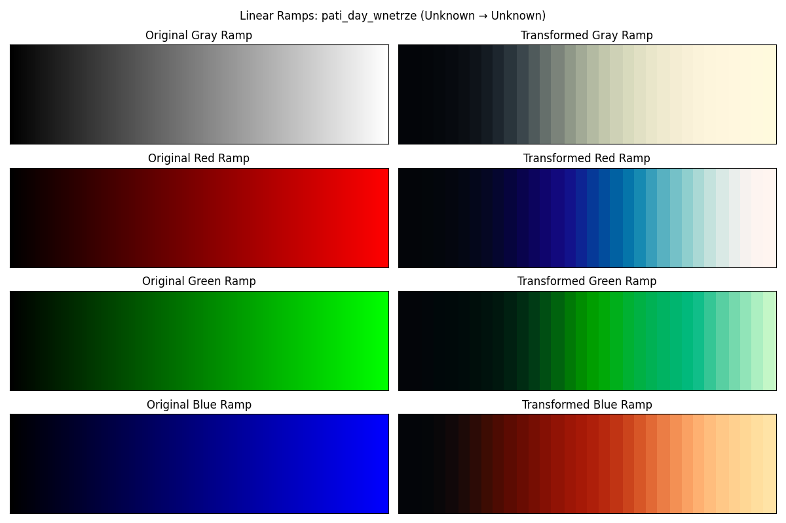  
*Linear Gradient Ramps*  

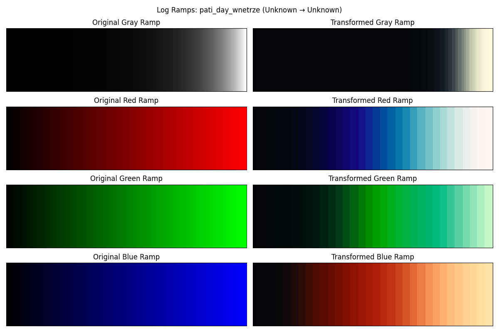  
*Logarithmic Gradient Ramps*  

### Technical Assessment

**Overall Quality Rating: Very Poor (8.27%)**

**Strengths:**  
- Good dynamic range preservation  
- Well-balanced color rendition  

**Weaknesses:**  
- Lower accuracy in color transformation  
- Potential banding issues in smooth gradients  

**Recommended Applications:**  
- Experimental or specific creative effects  

---

